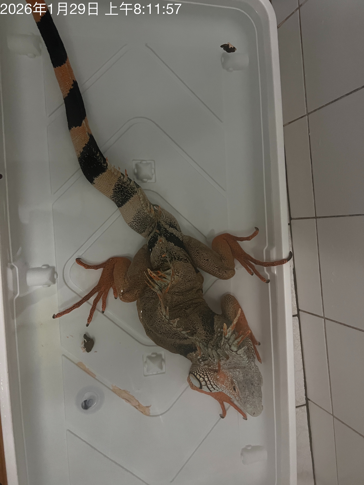
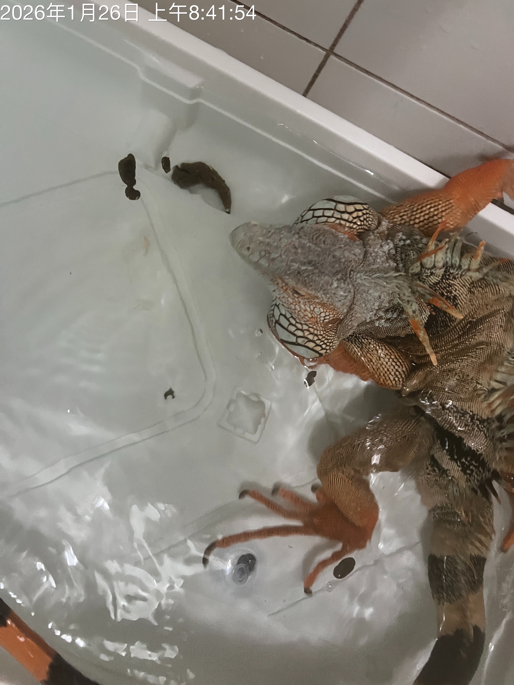
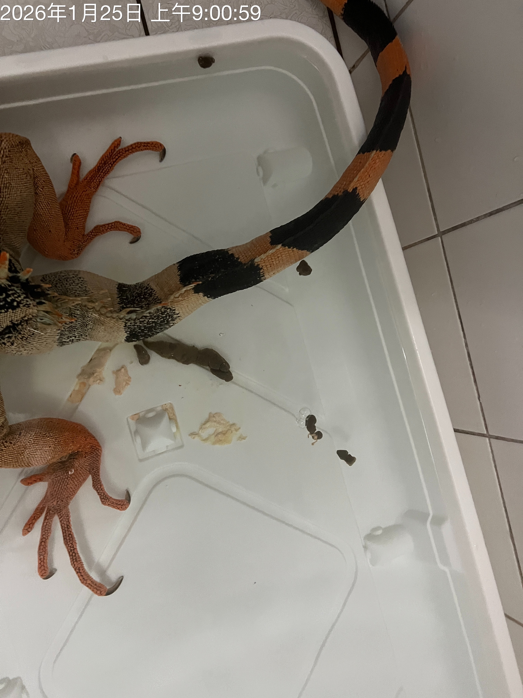
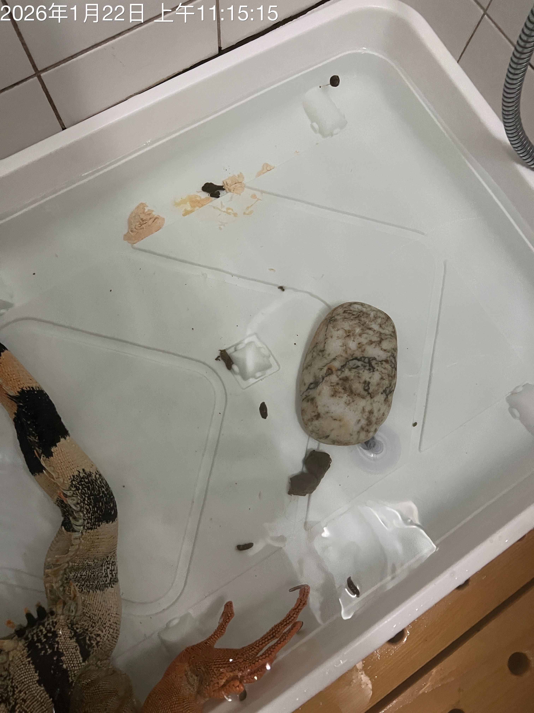
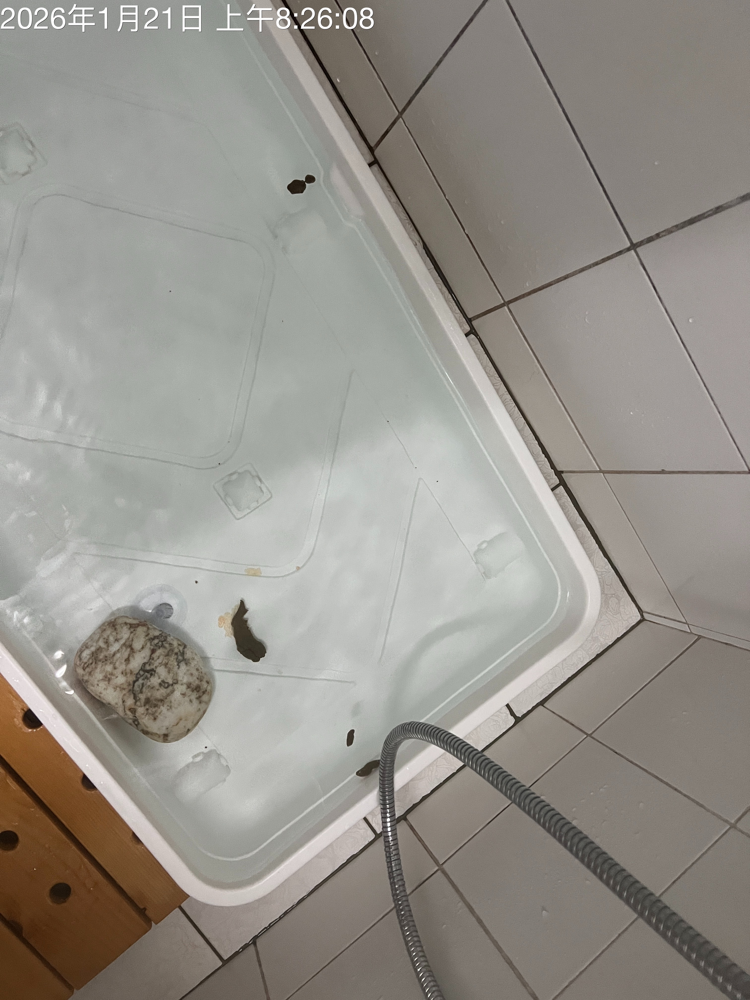
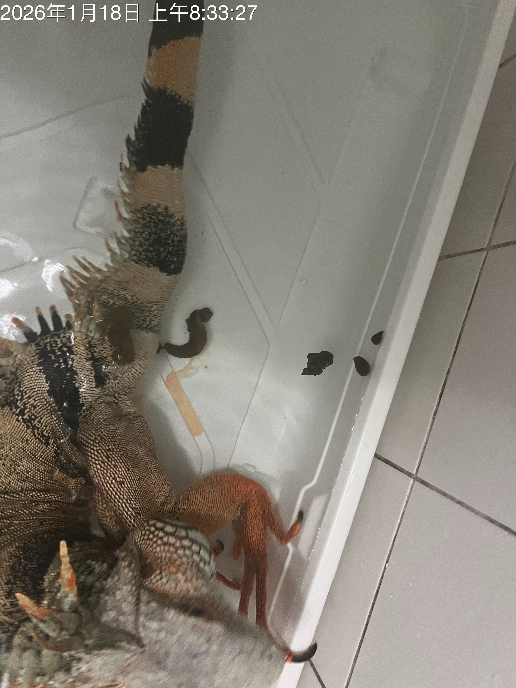
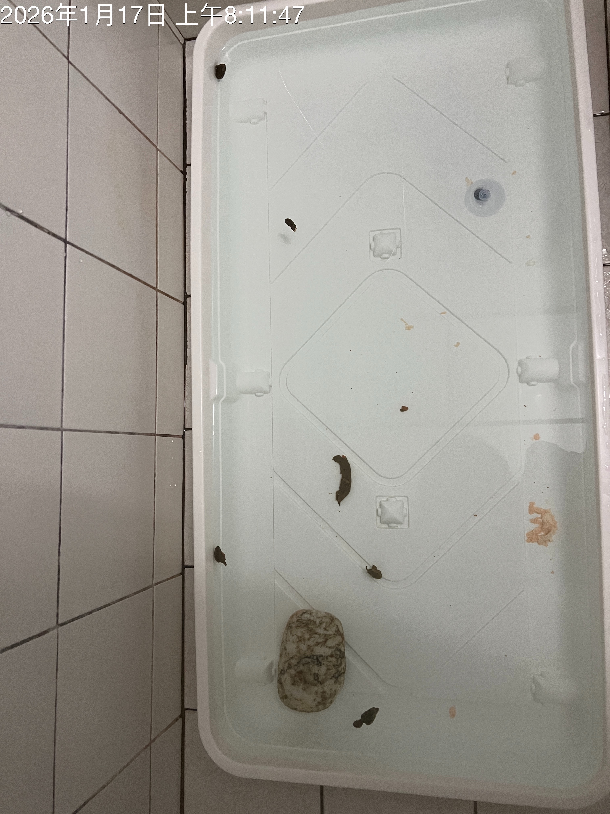
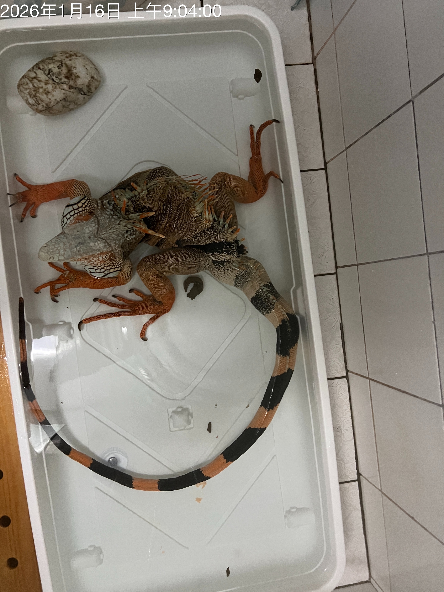

# 鬣寶中藥 2026/01/29

## 近況

- 口腔黏液：偶爾口水會積在喉嚨。有一次用針筒抽出 1CC，喉嚨還有一小攤。
- 哈氣（開嘴呼吸）：
  - 睡覺時：這兩天哈氣無法入睡，直立抱著可以比較好睡，需調整找姿勢，尚未確認能好好睡的姿勢。
  - 進食後：最近很少進食，有盡時也只吃一兩口。所以沒有進食後開嘴呼吸狀況。
  - 休息時：偶爾
- 大便：偏少偏硬。
- 食慾：減少 0~5g
- 體重 (kg)：（12/17：4.1kg）
- 精神：同
- 行動：同
- 保養品：同

## 大便照片 
- 1/29 
- 1/28 none
- 1/27 
- 1/26  
- 1/25 
- 1/24 none
- 1/23 none
- 1/22  
- 1/21  
- 1/20 
- 1/19 none
- 1/18  
- 1/17  
- 1/16  
