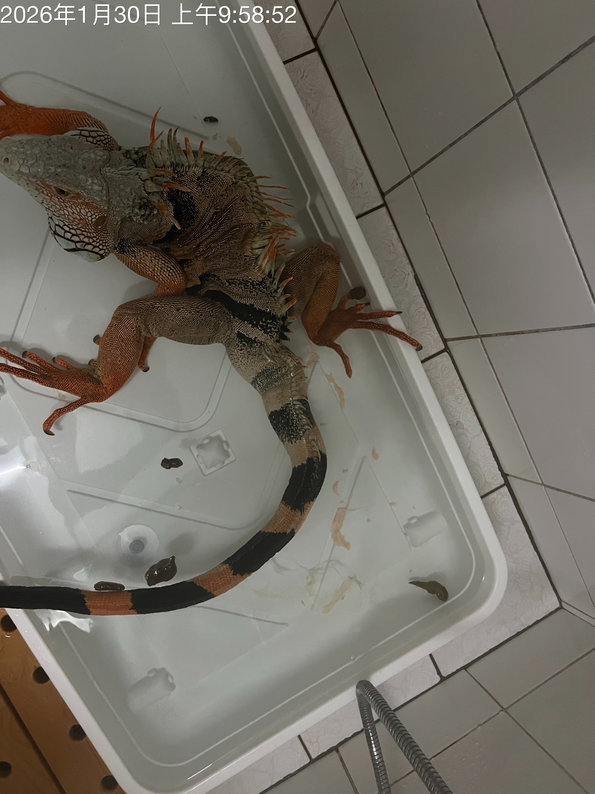
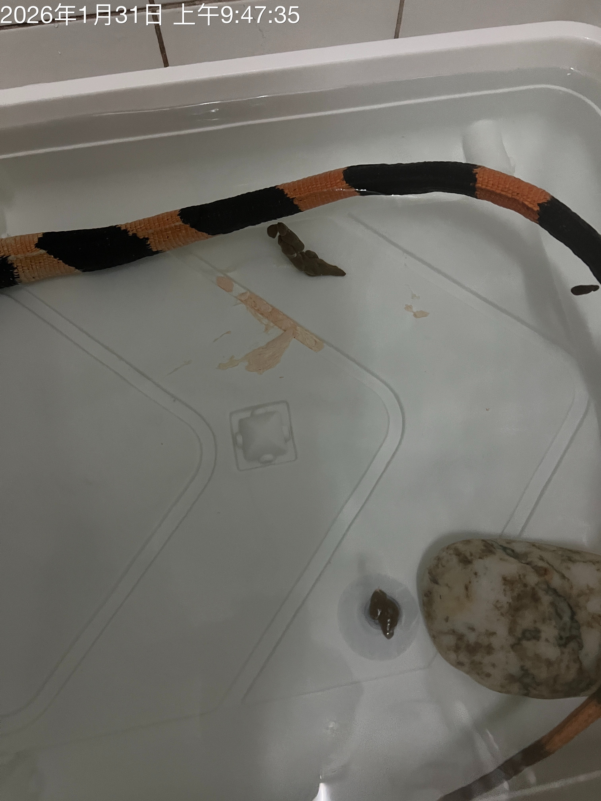
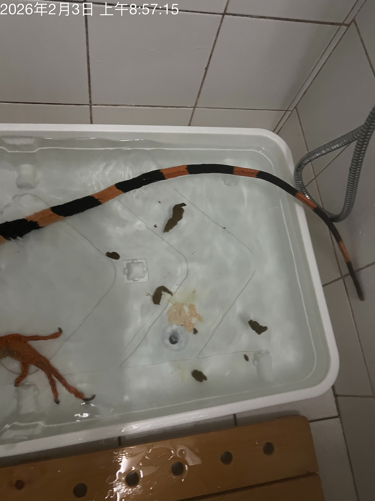
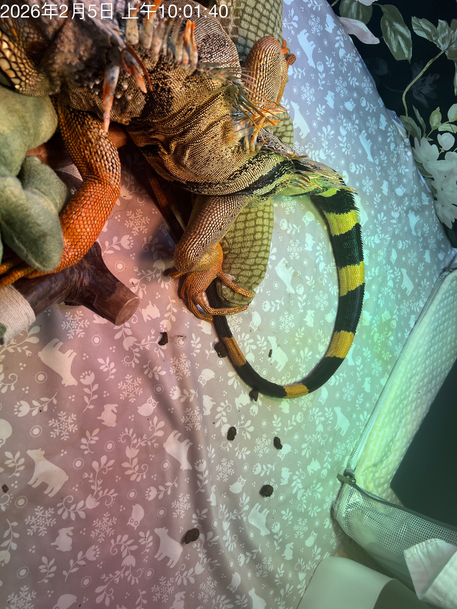
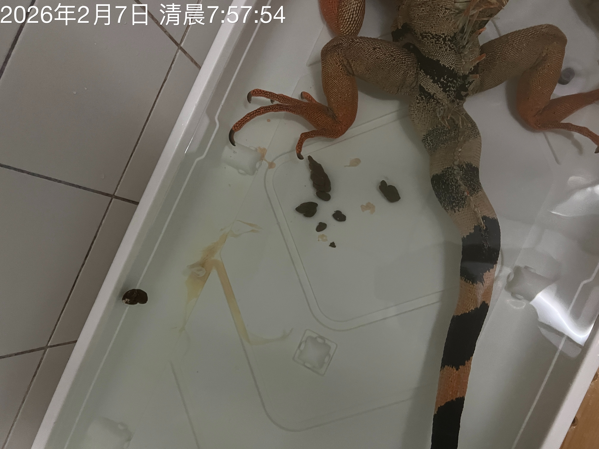
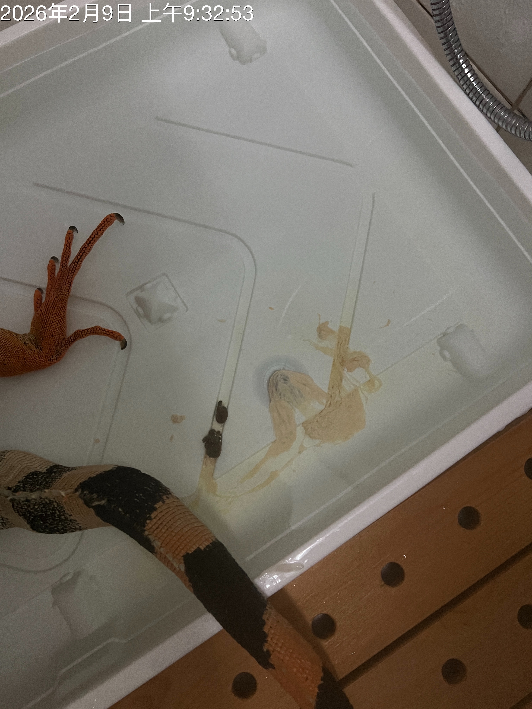
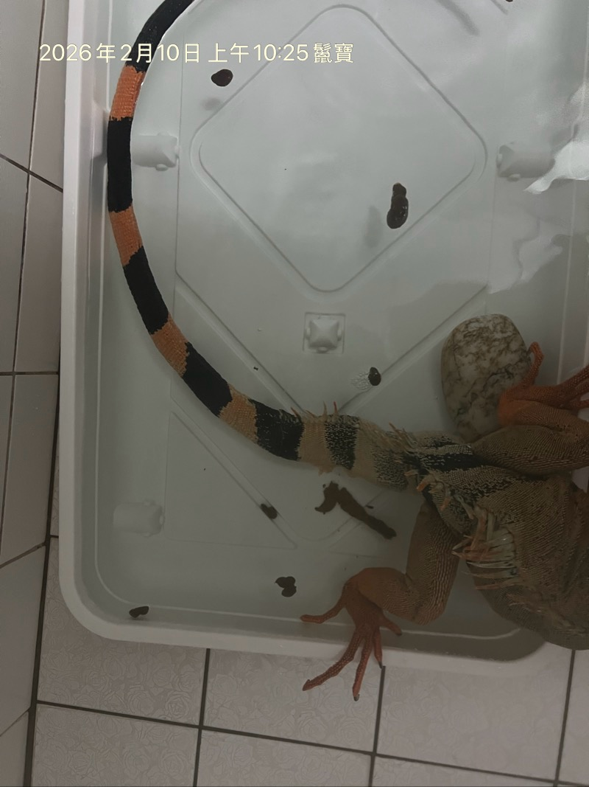
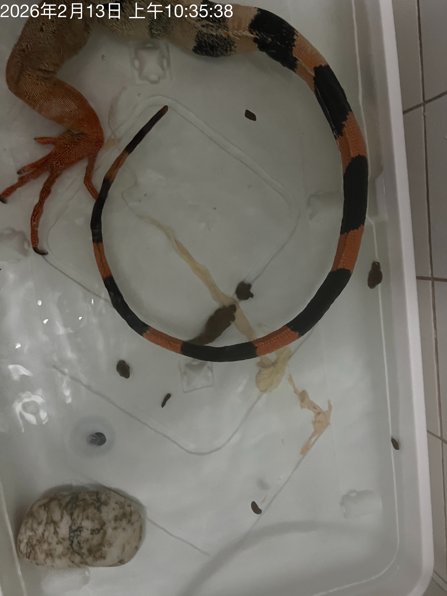
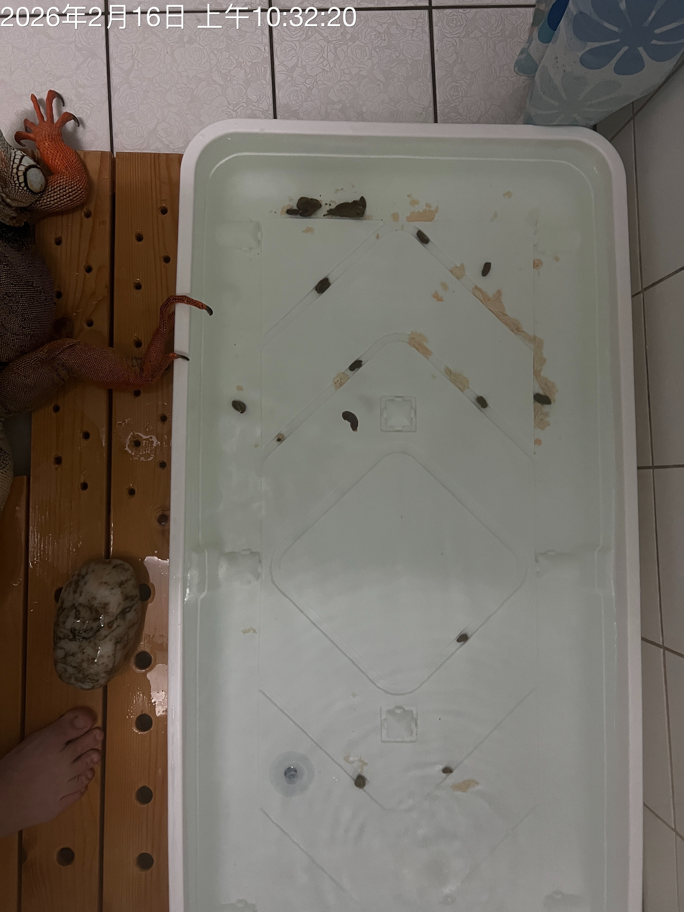

# 鬣寶中藥 2026/02/19 回報

1/29 的提問沒回應，但詢問櫃台，中藥有調整過。

## 近況 1/29~2/19

- 口腔黏液：透明、張嘴薄膜有些微氣泡。
- 哈氣（開嘴呼吸）：
  - 睡覺時：睡覺會想要直立入睡，找人爬。一直吞嚥、吐氣，大概二十～三十分鐘，後面穩定下來後才放到枕頭。
  - 進食後：少進食，吞藥丸吞水吞得久。
  - 休息時：經常開嘴，沒有到難以呼吸，但胸腔會用力起伏。
- 大便：偏少，常常沒大。
- 食慾：這兩週加起來大概只吃一兩口，外出曬太陽吃幾口草。
- 體重 (kg)：（2026/01/26：4.1kg）體感變輕
- 精神：如常
- 行動：如常
- 保養品：如常

## 大便照片 

- 1/30 
- 1/31   
- 2/1 
- 2/2 none
- 2/3 
- 2/4 none
- 2/5 
- 2/6 none
- 2/7 
- 2/8 none
- 2/9 
- 2/10 
- 2/11 none
- 2/12 none
- 2/13 
- 2/14 none
- 2/15 none
- 2/16 
- 2/17 none
- 2/18 none
- 2/19 
